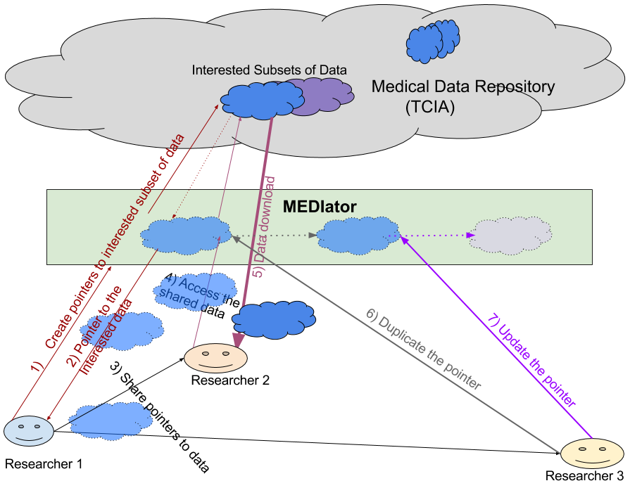

.. MEDIator documentation master file, created by
   sphinx-quickstart on Thursday July 21, 2016.
   You can adapt this file completely to your liking, but it should at least
   contain the root `toctree` directive.

*******************************************
MEDIator - Data Replication System for TCIA
*******************************************

MEDIator is a system that could provide data repositories with a seamless, and transparent, approach to give their users
the ability to share and publish research data — a one-way Dropbox like environment for the community which gives
researchers the ability to share data subsets, track and download updates, and publish data.

Getting Started With MEDIator
#############################

**`Sign up <https://lion.bmi.emory.edu/signup/>`_ to use the MEDIator APIs.**

Once you have received the API key from the developer portal above, you may use your keys to invoke the MEDIator REST API.

MEDIator RESTful APIs
#####################

.. toctree::
   :maxdepth: 1

   sections/restapi/Create
   sections/restapi/Retrieve
   sections/restapi/Update
   sections/restapi/Delete
   sections/restapi/Other

Data Sharing and Federation with MEDIator
#########################################

MEDIator allows sharing pointers to medical data efficiently, while letting the consumers manipulate the pointers
without modifying the raw medical data. MEDIator has been implemented for multiple data sources, including Amazon S3,
The Cancer Imaging Archive (TCIA), caMicroscope, and metadata from CSV files for cancer images.

Please note that MEDIator version 1.0 has been code named SPREAD (System for Sharing and Publishing Research Data). You
may find sentences referring to MEDIator by this code name.

This MEDIator deployment focuses on TCIA as its core data source.

The researcher initially finds some interesting data, and decides to bookmark them. MEDIator creates a pointer to the
data chosen by the researcher. This pointer uniquely identifies all the data that was initially of interest to the
researcher. The researcher now shares this pointer to the data with his/her colleagues.

The other researcher, using this uniquely identifiable pointer, accesses and downloads the actual data. Moreover, he/she
may duplicate pointer, as well as modify the duplicated pointer to point to a slightly changed subset of data as well.

MEDIator stores these pointers in an in-memory data grid for an efficient storage and access. These pointers are called
'replica sets' in MEDIator.

Citing MEDIator
###############

If you have used MEDIator in your research, please cite the below papers:

[1] Kathiravelu, P. & Sharma, A. (2015). **MEDIator: A Data Sharing Synchronization Platform for Heterogeneous Medical Image Archives.**
In *Workshop on Connected Health at Big Data Era (BigCHat'15), co-located with 21st ACM SIGKDD Conference on Knowledge Discovery and Data Mining (KDD 2015)*.
Aug. 2015. ACM. 6 pages. http://doi.org/10.13140/RG.2.1.3709.4248

[2] Kathiravelu, P. & Sharma, A. (2016). **SPREAD - System for Sharing and Publishing Research Data**. In *Society for Imaging
Informatics in Medicine Annual Meeting (SIIM 2016)*. June 2016.
http://c.ymcdn.com/sites/siim.org/resource/resmgr/siim2016abstracts/Research_Kathiravelu.pdf
